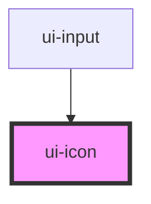

# ui-icon

<!-- Auto Generated Below -->

## Properties

| Property | Attribute | Description | Type                                           | Default     |
| -------- | --------- | ----------- | ---------------------------------------------- | ----------- |
| `name`   | `name`    |             | `"CalendarIcon" \| "CheckIcon" \| "CloseIcon"` | `undefined` |

## Dependencies

### Used by

 - [ui-input](../ui-input)

### Graph

----------------------------------------------

*Built with [StencilJS](https://stenciljs.com/)*
