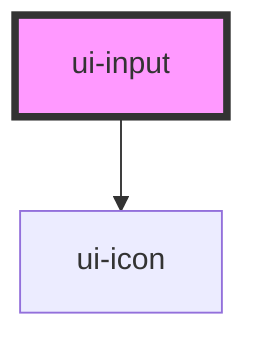

# ui-input

<!-- Auto Generated Below -->

## Properties

| Property  | Attribute | Description | Type                                           | Default     |
| --------- | --------- | ----------- | ---------------------------------------------- | ----------- |
| `error`   | `error`   |             | `boolean`                                      | `undefined` |
| `icon`    | `icon`    |             | `"CalendarIcon" \| "CheckIcon" \| "CloseIcon"` | `undefined` |
| `label`   | `label`   |             | `string`                                       | `undefined` |
| `success` | `success` |             | `boolean`                                      | `undefined` |
| `type`    | `type`    |             | `string`                                       | `undefined` |
| `value`   | `value`   |             | `string`                                       | `undefined` |

## Dependencies

### Depends on

- [ui-icon](../ui-icon)

### Graph

----------------------------------------------

*Built with [StencilJS](https://stenciljs.com/)*
